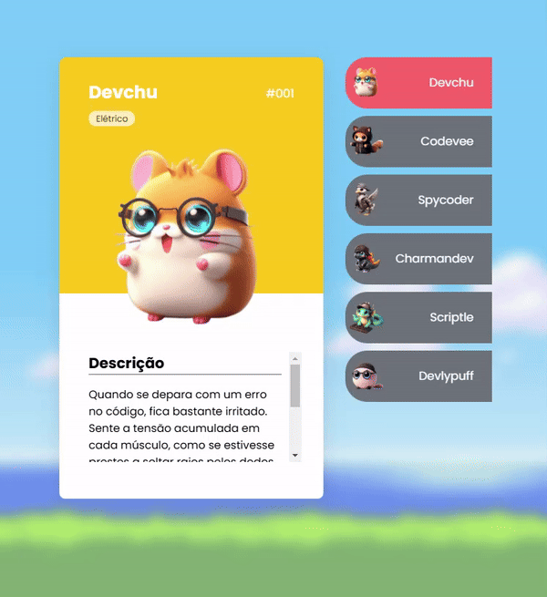

# Projeto Pokédevs
Meu primeiro projeto com o desenvolvimento web, de um evento de programação realizado pelo DevEmDobro. (https://www.youtube.com/@DevemDobro)

Landing Page de lista de pokedevs



## Tecnológias utilizadas:

- HTML
- CSS
- JavaScript

## Como Utilizar:

1- Clone pro o projeto
```
git clone <url>
```

2- Acesse a pasta do projeto 
```
cd README.md
```
